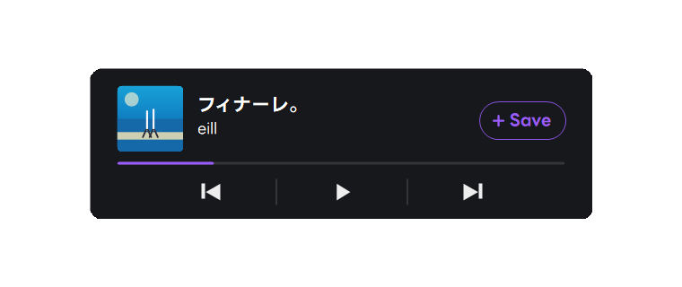

# Spotify Hotkey Saver - Release Package

[日本語](#日本語) / [English](#english)



## 日本語

Spotify Hotkey Saver は、Spotify を前面に表示しなくても、キーボードショートカットでプレイリストに保存、再生／停止、前後のスキップを行える Windows 常駐アプリです。

特殊なハードウェア、デバイスは不要です。作業中、ゲーム中、ブラウザ操作中でも、Spotify をバックグラウンドに置いたまま操作できます。必要に応じて、現在再生中の曲を確認できる小型オーバーレイも表示できます。

Spotify 認証には OAuth 2.0 の PKCE 方式を使用します。利用者ごとに Spotify Developer Dashboard で自分用のアプリを作成し、その Client ID を本アプリの Settings に設定します。Client Secret は使用しません。

### 主な機能

* `Ctrl + Alt + S` で、現在再生中の曲を指定したプレイリストに保存
* グローバルショートカットによる再生／停止、前の曲、次の曲の操作
* Spotify を前面に表示しないバックグラウンド操作
* トレイアイコンからの保存、再生／停止、前後スキップ、オーバーレイ切り替え
* ジャケット画像、曲名、アーティスト名、再生進行状況を表示する小型オーバーレイ
* オーバーレイ内の Save／前へ／再生・停止／次へボタン
* オーバーレイの移動、固定比率リサイズ、色、文字色、透明度の調整
* 長い曲名・アーティスト名のスムーズなスクロール表示
* 保存成功時の通知音オン／オフ
* Windows DPAPI による Spotify トークンのローカル暗号化保存

### ダウンロード

最新版は、公開リリース用リポジトリからダウンロードできます。

[https://github.com/elqxti1e/SpotifyHotkeySaver-Releases/releases](https://github.com/elqxti1e/SpotifyHotkeySaver-Releases/releases)

リリースページから `SpotifyHotkeySaver.zip` をダウンロードし、任意の場所に展開してください。展開後、次のファイルを実行します。

```text
dist/SpotifyHotkeySaver.exe
```

`dist/Assets/` フォルダは、実行ファイルと同じ場所に置いたままにしてください。フォントや通知音などの同梱ファイルを読み込むために必要です。

### 動作環境

* Windows 11
* Spotify アカウント
* 自分が編集できる Spotify プレイリスト
* 自分で作成した Spotify Developer アプリ

配布版は self-contained 形式です。.NET Runtime や .NET SDK を別途インストールする必要はありません。

再生／停止やスキップなど一部の Spotify 操作は、Spotify Premium と有効な再生デバイスが必要になる場合があります。

### 初期設定

1. `SpotifyHotkeySaver.exe` を起動します。
2. Settings 画面が自動で開かない場合は、トレイアイコンから Settings を開きます。
3. `Open Dashboard` を押して Spotify Developer Dashboard を開きます。
4. Spotify Developer Dashboard で新しいアプリを作成します。
5. 本アプリの Settings で `Copy Redirect URI` を押します。
6. コピーした Redirect URI を Spotify Developer アプリの設定に追加します。
7. Spotify Developer アプリの Client ID をコピーします。
8. 本アプリの `Spotify Client ID` に Client ID を貼り付けます。
9. `Playlist ID or URL` に、保存先プレイリストの URL または ID を入力します。
10. `Save & Login` を押します。
11. ブラウザで Spotify 認証を許可します。

初期設定の Redirect URI は次のとおりです。

```text
http://127.0.0.1:43879/callback
```

`localhost` ではなく、`127.0.0.1` を使用してください。

Client Secret は不要です。本アプリには Client Secret を入力する項目もありません。

### Spotify Developer アプリの設定

Spotify Developer Dashboard:

[https://developer.spotify.com/dashboard](https://developer.spotify.com/dashboard)

追加する Redirect URI:

```text
http://127.0.0.1:43879/callback
```

本アプリが要求する Spotify scope:

```text
user-read-currently-playing
user-modify-playback-state
playlist-modify-private
playlist-modify-public
```

Spotify Developer アプリが Development Mode の場合、利用できる Spotify アカウントが制限されることがあります。通常利用では、利用者ごとに自分用の Spotify Developer アプリを作成し、Client ID を設定してください。

### 標準ショートカット

| 操作 | ショートカット |
| --- | --- |
| 現在の曲を保存 | `Ctrl + Alt + S` |
| 次の曲 | `Ctrl + Alt + Right` |
| 前の曲 | `Ctrl + Alt + Left` |
| 再生／停止 | `Ctrl + Alt + Space` |
| オーバーレイ切り替え | `Ctrl + Alt + O` |

ショートカットは Settings から変更できます。

#### ショートカットの制限

* `F12` は予約キーのため使用できません。
* 同じショートカットを複数の操作に割り当てることはできません。
* 他のアプリが同じショートカットを使用している場合、登録に失敗することがあります。

### トレイメニュー

トレイアイコンを右クリックすると、次の操作を実行できます。

* Save Current Track
* Play/Pause
* Previous Track
* Skip Next
* Overlay on/off
* Settings
* Setup Guide
* Re-login Spotify
* Open Logs
* Exit

オーバーレイのオン／オフを切り替えた場合、オフにする前の表示モードを記憶します。

### オーバーレイ

オーバーレイには、現在再生中の曲情報と操作ボタンを表示できます。

表示内容:

* ジャケット画像
* 曲名
* アーティスト名
* Save ボタン
* 前へ／再生・停止／次へボタン
* 再生進行バー

操作:

* オーバーレイの通常部分をドラッグして移動
* 右下角をドラッグして固定比率でリサイズ

表示モード:

* Off: 操作してもオーバーレイを表示しません。
* Show on action: 保存や再生操作のあとにオーバーレイを表示します。
* Always on: 常に現在の曲を表示します。

設定できる見た目:

* アクセントカラー
* 背景色
* 文字色
* 透明度
* 見た目のリセット

`Reset appearance` は、色と透明度のみを初期値に戻します。オーバーレイの位置やサイズはリセットしません。

### 保存音

保存に成功したときだけ、短い通知音が鳴ります。スキップ、前の曲、再生／停止、曲変更、エラー時には鳴りません。

通知音は Settings 画面の `Save success sound` チェックボックスから無効化できます。

### トラブルシューティング

#### Windows SmartScreen warning

本アプリは未署名の個人開発アプリです。初回起動時に Windows SmartScreen の警告が表示される場合があります。信頼できる入手元から取得したファイルのみ実行してください。

#### Spotify login failed

次の点を確認してください。

* Client ID が正しく入力されているか
* Redirect URI が Spotify Developer Dashboard に登録されているか
* Redirect URI に `http://127.0.0.1:43879/callback` を使用しているか
* `localhost` ではなく `127.0.0.1` を使用しているか

解決しない場合は、トレイメニューの `Re-login Spotify` を試してください。

#### No track is currently playing

Spotify で曲を再生してから、もう一度操作してください。

#### Current item is not a track

Podcast など、曲ではない項目はトラックとして保存できません。

#### Failed to save track

次の点を確認してください。

* プレイリスト ID または URL が正しいか
* 自分の Spotify アカウントで、そのプレイリストを編集できるか

解決しない場合は、トレイメニューの `Re-login Spotify` を試してください。

#### Skip Next / Play/Pause does not work

次の点を確認してください。

* Spotify Premium が必要な操作ではないか
* 有効な Spotify 再生デバイスがあるか
* Spotify デスクトップアプリまたは Web Player で再生を開始しているか

#### Overlay is not visible

次の点を確認してください。

* Overlay mode が Off になっていないか
* トレイメニューの `Overlay on/off` がオフになっていないか
* Overlay notification on/off が有効になっているか
* 排他的フルスクリーンのアプリを使用していないか

排他的フルスクリーンのアプリでは、オーバーレイが表示されない場合があります。

### ローカルファイル

設定ファイル:

```text
%AppData%\SpotifyHotkeySaver\config.json
```

Spotify トークン:

```text
%AppData%\SpotifyHotkeySaver\tokens.dat
```

ログ:

```text
%LocalAppData%\SpotifyHotkeySaver\logs\
```

OAuth トークンは Windows DPAPI で暗号化して保存されます。本アプリは、平文の access token、refresh token、Client Secret を保存しません。


### 配布リポジトリについて

このリポジトリは公開配布パッケージ専用です。ソースコードは含まれていません。

## English

Spotify Hotkey Saver is a Windows tray app that lets you control Spotify in the background with normal global keyboard shortcuts. You can save the current track, play/pause, skip next, and go back without bringing Spotify to the front.

No Stream Deck or special keyboard is required. The overlay is an optional helper for viewing the current track and playback controls.

This repository contains the public release package only. Source code is not included here.

### Download

Download the latest release:

```text
https://github.com/elqxti1e/SpotifyHotkeySaver-Releases/releases
```

Release assets:

- `SpotifyHotkeySaver.zip`
- `SHA256SUMS.txt`

Extract the zip and run:

```text
dist/SpotifyHotkeySaver.exe
```

Keep the `dist/Assets/` folder next to the executable.

### Setup

Each user should create their own Spotify Developer app and enter their own Client ID in Settings. Client Secret is not used.

1. Run `SpotifyHotkeySaver.exe`.
2. Open Settings from the tray icon if it does not open automatically.
3. Click `Open Dashboard`.
4. Create a Spotify app in the Spotify Developer Dashboard.
5. Click `Copy Redirect URI` in Settings.
6. Add the copied Redirect URI to the Spotify app settings.
7. Copy the Spotify app's Client ID.
8. Paste the Client ID into `Spotify Client ID`.
9. Paste the target playlist URL or playlist ID into `Playlist ID or URL`.
10. Click `Save & Login`.
11. Approve the Spotify authorization in the browser.

Default Redirect URI:

```text
http://127.0.0.1:43879/callback
```

Use `127.0.0.1`, not `localhost`.

### Security

This release zip does not include any personal Spotify Client ID, Playlist ID, OAuth token, `config.json`, or `tokens.dat`.

User-specific settings and tokens are created locally at runtime:

```text
%AppData%\SpotifyHotkeySaver\config.json
%AppData%\SpotifyHotkeySaver\tokens.dat
```

OAuth tokens are encrypted with Windows DPAPI before being saved.
